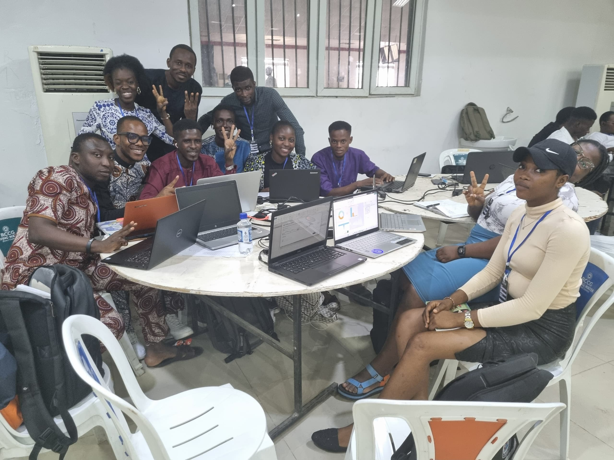
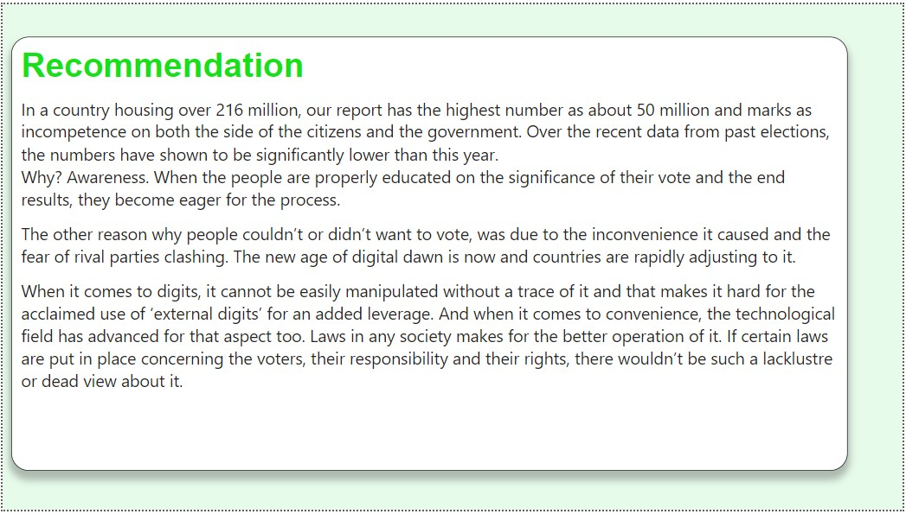
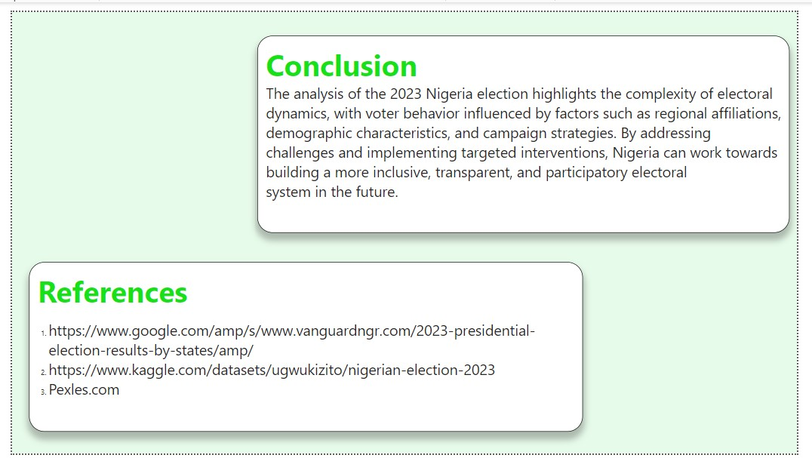

# FCB-Group-3-Project
This is a collarborative group work I Co-Lead during the Future Clan Bootcamp in the Data analysis class. We were given an assignment to gather dataset  in the area of Government, analyze and create a report out of it. After much deliberation we resolve to working on 2023 Nigerian Presidential Election focusing on the four major candidtate. This analysis was carried out from the already exiting data of the 2023 election in which was said to have one of the highest turnouts in the history of Nigeria. 
## Team Redemption

## Report and Visualization of 2023 Nigerian Presidential Election
From Street to Spreadsheets: How data caputres the pulse of Nigeria's 2023 Presidentail Election Election.   How data caputres the pulse of Nigeria's 2023 Presidentail Election Election.  

## Table of Content

Introduction

Data Source

Tool Used

Data Transformation and Loading

Data Analysis and Visualization

Insights and Implications

Recommendation

Conclusion

- - -

## Introduction
The aim of this project is to develop an interactive dashboard that provide a comprehensive overview of election results across various states and geopolitical zones.
The dashboard will also provide key metrics such as total votes per party, distribution of vote according to geo-political zone and how each candidate performance in general. 

## Data Sources 
The primary data sources for this project is gotten from Kaggle.com and vanguardngr.com
https://www.google.com/amp/s/www.vanguardngr.com/2023-presidential-election-results-by-states/amp/
https://www.kaggle.com/datasets/ugwukizito/nigerian-election-2023

## Tools Used
- **Ms Excel** [Download here](https://www.microsoft.com)
- **Microsoft Power BI** [Donwload here](https://www.microsoft.com/en-us/download/details.aspx?id=58494)

## Data Transformation and Loading
Using the power query editor, we cleaned the data, which means we made sure it was neat and ready to be analyzed. We dealt with the inconsistency with the data type, check the column quality and distribution to ensure everything is okay. 

## Data Analysis and Visualization
With the data in Power BI dashboard area, we started analyzing it to find interesting patterns and created visual charts to show these patterns clearly. 
These visuals help understand things like which candidate, political party, geo-political zone has most of the vote.
We made use of the slicer tool to compare candidate performance and how the candidate perfom accoding to geo-politicial zones.
We also made use of Card tool to show total number of state, local government area, vote per candidtate etc.

## Insights
Tinubu: Secured victory with 8 million votes, demonstrating broad support across various regions.

Atiku: Narrowly trailed with 6 million votes, showcasing national appeal, particularly in key battleground states.

Obi: Earned 6 million votes, representing a notable presence in specific regions or demographic groups.

Kwankwanso:  Received 1 million votes, adding to the diversity of political voices.

Total Votes Cast: 22 million votes, emphasizing the significance of the electoral process in shaping Nigeria's political landscape.

## Recommendation

## Conclusion

